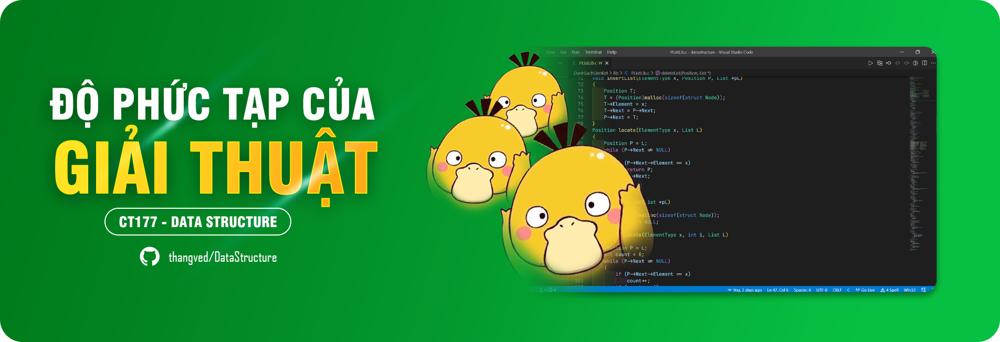

# CẤU TRÚC DỮ LIỆU

> Xin chào mọi người, tôi là **ZỊT**... à mà thôi đi. Tôi không biết gì hết, toi chỉ là một con **ZỊT** 🦆 🦆.

## LIÊN KẾT

### ĐỘ PHỨC TẠP CỦA GIẢI THUẬT

### CÁC KIỂU TRỪU TƯỢNG CƠ BẢN

⚙️ [Hàng đợi (Chờ cập nhật...)](./HangDoi)

⚙️ [Cây (Chờ cập nhật...)](./Cay)

## ĐÓNG GÓP

✅ [Đóng góp](./CONTRIBUTING.md)
